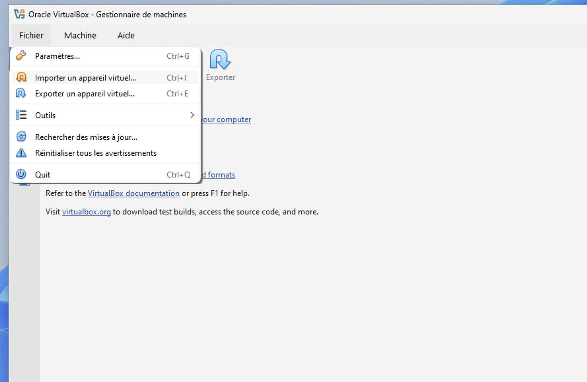
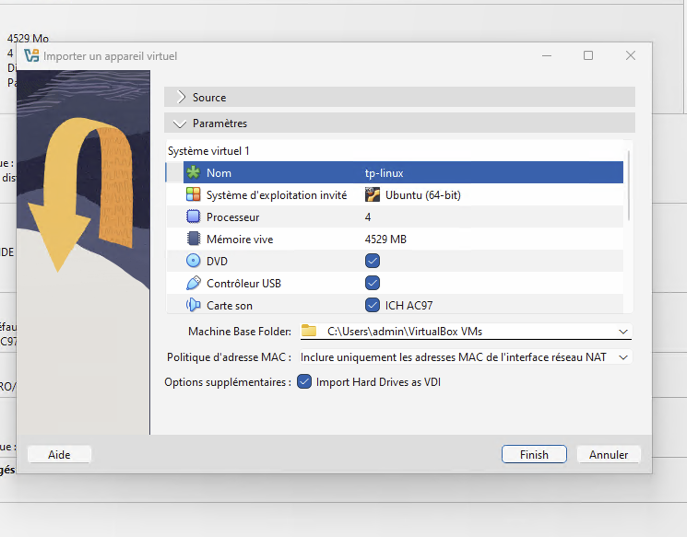
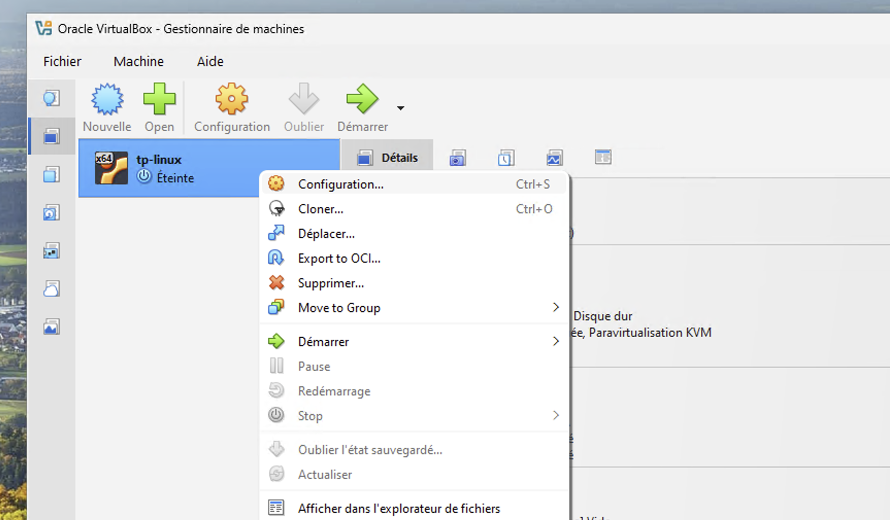
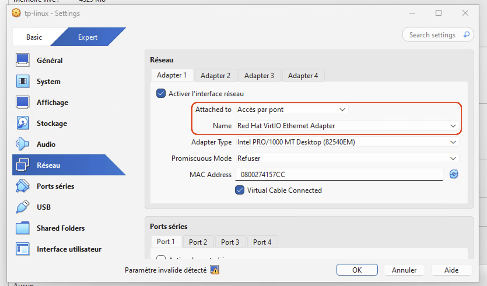
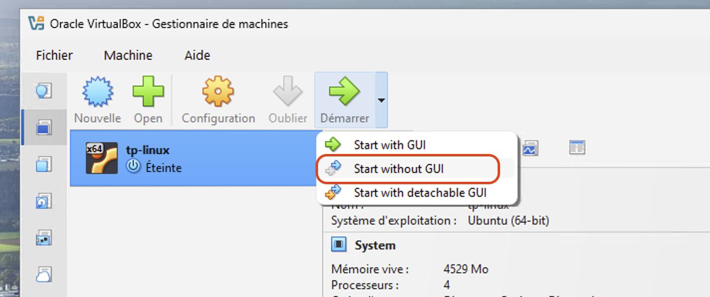

# TP de révisions — Administration système GNU/Linux

**1CIEL-IR — Durée : 4h — Ce TP prépare l'évaluation Linux.**


> *Nous sommes en 50 avant J.-C. Toute la Gaule est occupée par les Romains… Toute ? Non ! Un village peuplé d'irréductibles Gaulois résiste encore et toujours à l'envahisseur. Le chef Abraracourcix a décidé d'informatiser le village et vous confie l'administration du serveur `village-gaulois`.*

Ce TP révise **l'ensemble** des notions vues cette année : terminal, arborescence, gestion de fichiers, paquets, utilisateurs, groupes, permissions, réseau et SSH.

---

## 🚀 Avant de commencer

> [!IMPORTANT]
> **Ce dépôt est votre rendu.**
>
> 1. **Forkez ce dépôt** sur votre compte GitHub — bouton **Fork**, en haut à droite de cette page.
> 2. Suivez le sujet ci-dessous : la **mission 0** installe la VM, la **mission 1** vous guide pour cloner votre fork dessus.
> 3. Rédigez vos réponses dans un fichier `COMPTE-RENDU.md` que vous créerez à la racine de votre fork.
> 4. Committez et poussez à la fin de **chaque mission** :
>    ```bash
>    git add .
>    git commit -m "Mission N"
>    git push
>    ```
> 5. Communiquez l'URL de votre fork à l'enseignant en fin de séance.

### Environnement de travail

| | |
| --- | --- |
| **Poste** | Ubuntu Desktop 24.04 LTS |
| **VM** | Ubuntu Server 24.04 LTS sous VirtualBox (`UbuntuServer_TP.ova`, sur le partage NAS) |
| **Réseau VM** | Accès par pont — IP en DHCP au démarrage, puis IP statique en mission 7 |
| **Connexion** | SSH depuis le terminal du poste, VM lancée en mode headless |
| **Identifiants VM** | `etudiant` / `rascol` |

### En cas de blocage

- Chaque commande dispose de son manuel : `man <commande>`
- Les encadrés 🟦 **Note** du sujet anticipent les difficultés fréquentes — lisez-les.
- Si le réseau de la VM devient inaccessible, la console VirtualBox reste toujours disponible (bouton *Afficher*).

---

## Sommaire

| Mission | Objectif | Points |
| :---: | --- | :---: |
| **0** | Récupérer, importer et démarrer la VM, s'y connecter en SSH | 4 |
| **1** | Forker ce dépôt et le cloner sur la VM | 3 |
| **2** | Reconnaissance du système | 3 |
| **3** | Gestion des fichiers et des dossiers | 4 |
| **4** | Le gestionnaire de paquets `apt` | 2 |
| **5** | Utilisateurs et groupes | 4 |
| **6** | Permissions | 6 |
| **7** | Réseau : passage en IP fixe | 4 |
| | **Total** | **/30** |

> [!NOTE]
> **Ce qu'on attend dans le compte rendu**
>
> Pour **chaque question** : la ou les commandes utilisées, **et** le résultat obtenu (copier-coller du terminal). Une commande recopiée du sujet sans son résultat ne vaut pas réponse.
>
> Le copier-coller depuis le terminal est l'une des raisons pour lesquelles on travaille en SSH plutôt que dans la console VirtualBox.

---

## Mission 0 — Mise en place de la VM

Vous travaillez sur un poste **Ubuntu Desktop 24.04 LTS**. La machine à administrer est une VM **Ubuntu Server 24.04 LTS** que vous allez importer dans **VirtualBox**.

### 0.1 — Récupérer le fichier OVA

Le fichier de la VM est mis à disposition sur le **partage réseau du NAS**, accessible depuis votre session étudiante.

Ouvrez un terminal sur votre poste (raccourci `Ctrl` + `Alt` + `T`).

### ❓ Question 0.1

1. Rendez-vous dans le dossier du partage et repérez le fichier :
   ```bash
   cd /partages_etudiants/iso/
   ls -lh UbuntuServer_TP.ova
   ```
   Relevez la **taille** du fichier.
2. Copiez-le dans votre dossier personnel — on travaille toujours sur une copie locale, jamais directement sur le partage réseau :
   ```bash
   cp /partages_etudiants/iso/UbuntuServer_TP.ova ~/
   ```
3. Vérifiez la présence de la copie avec `ls -lh ~`. Sa taille correspond-elle à celle de l'original ?

> [!NOTE]
> Le fichier est volumineux (plusieurs Go) : la copie prend un certain temps et `cp` n'affiche **aucune barre de progression**. Tant que le curseur n'est pas revenu, la copie est en cours — laissez-la se terminer.

> [!NOTE]
> **Si le chemin ne correspond pas**
>
> Selon la configuration de votre session, le partage peut être monté à un autre emplacement :
> ```bash
> ls /partages_etudiants
> # ou, pour rechercher le fichier :
> find / -name "UbuntuServer_TP.ova" 2>/dev/null
> ```
> La redirection `2>/dev/null` masque les nombreux messages « permission refusée » de `find`.

### 0.2 — Importer la VM dans VirtualBox

1. Lancez **VirtualBox** depuis le menu des applications.
2. Menu **Fichier → Importer un appareil virtuel…**

    

3. Sélectionnez le fichier `UbuntuServer_TP.ova` copié dans votre dossier personnel.
4. Dans l'onglet des paramètres, changez le nom de la VM en **`tp-revisions`**.

    

5. Cliquez sur **Finish** pour lancer l'importation.

### 0.3 — Configurer le réseau de la VM

Avant de démarrer, il faut vérifier le mode réseau de la carte virtuelle.

1. Clic droit sur la VM → **Configuration**.

    

2. Onglet **Réseau** : le mode d'accès doit être **Accès par pont** (*Bridged Adapter*), et la carte sélectionnée doit être la carte réseau **filaire** de votre poste. **Re-sélectionnez-la explicitement dans la liste**, même si elle semble déjà choisie.

    

> [!NOTE]
> **Pourquoi l'accès par pont ?**
>
> En accès par pont, la VM est vue comme une machine à part entière sur le réseau de la salle : elle obtient sa propre adresse IP du serveur DHCP et vos camarades peuvent la joindre. C'est indispensable pour les missions 0.6 et 7.

### 0.4 — Premier démarrage et connexion

Démarrez la VM. Une fenêtre console s'ouvre. Identifiez-vous :

```text
login    : etudiant
password : rascol
```

> [!NOTE]
> **Le mot de passe ne s'affiche pas pendant la saisie** (pas même des étoiles) : c'est le comportement normal d'une console Linux, tapez-le « à l'aveugle » puis validez.

### 0.5 — Relever l'adresse IP fournie par le DHCP

La VM a reçu automatiquement une adresse IP du serveur **DHCP** de la salle.

### ❓ Question 0.5

1. Dans la console VirtualBox, tapez `ip a`.
2. Relevez le **nom de l'interface réseau** (elle commence par `en…`, ce n'est pas `lo`).
3. Relevez l'**adresse IPv4** attribuée à cette interface, ainsi que son **masque** (le `/24` qui suit).
4. Relevez l'**adresse MAC** de l'interface (ligne `link/ether`).

> [!NOTE]
> `lo` est l'interface de *loopback* (127.0.0.1), la boucle locale interne à la machine. Ce n'est jamais celle qui vous intéresse pour communiquer sur le réseau.

### 0.6 — Passage en mode headless et connexion SSH

Travailler dans la console VirtualBox est vite pénible : pas de copier-coller, pas de redimensionnement, une seule fenêtre. Le mode **headless** démarre la VM sans afficher de console : on s'y connecte ensuite en **SSH** depuis le terminal du poste.

1. Éteignez proprement la VM depuis la console :
   ```bash
   sudo poweroff
   ```
2. Dans VirtualBox, démarrez la VM en **Démarrage sans affichage** (*Headless Start*).

    

3. Depuis le terminal de votre poste Ubuntu, connectez-vous :
   ```bash
   ssh etudiant@ADRESSE_IP_DE_LA_VM
   ```

> [!NOTE]
> À la première connexion, SSH affiche un avertissement sur l'authenticité de l'hôte et une empreinte de clé : répondez `yes`. Cette empreinte identifie le serveur et sera mémorisée dans `~/.ssh/known_hosts` pour détecter une éventuelle usurpation lors des connexions suivantes.

### ❓ Question 0.6

1. Quelle commande avez-vous tapée exactement pour vous connecter ?
2. Une fois connecté, exécutez `hostname` puis `whoami`. Que renvoient-elles, et sur quelle machine s'exécutent-elles réellement ?
3. À quoi sert la commande `exit` dans une session SSH ?

**⚠️ Toute la suite du TP se déroule dans cette session SSH, sur la VM.**

---

## Mission 1 — Forker et cloner le dépôt du TP

*Avant de toucher au village, il faut récupérer les plans — et pouvoir rendre son travail.*

Ce TP est distribué sous forme de **dépôt Git hébergé sur GitHub**. Vous allez en créer votre propre copie (un **fork**) sur votre compte personnel, puis la **cloner** sur la VM pour y travailler. C'est ce fork qui servira de rendu.

```text
  Dépôt de l'enseignant  ---fork--->  Votre dépôt GitHub  ---clone--->  Votre VM
       (GitHub)                          (GitHub)                          |
                                              ^                            |
                                              +----------push-------------+
```

### 1.1 — Forker le dépôt sur votre compte GitHub

> [!NOTE]
> **Fork ou clone ?**
>
> Un **fork** est une copie du dépôt **sur votre compte GitHub** : vous en devenez propriétaire et pouvez y pousser vos modifications. Un **clone** est une copie **sur une machine locale**. Vous n'avez pas le droit d'écrire dans le dépôt de l'enseignant : c'est pourquoi il faut d'abord forker, puis cloner **votre** fork.

### ❓ Question 1.1

1. Depuis le navigateur de votre poste, connectez-vous à [github.com](https://github.com) avec votre compte personnel (créez-en un si nécessaire).
2. Ouvrez la page du dépôt du TP : `<URL_REPO_GITHUB>`
3. Cliquez sur le bouton **Fork** en haut à droite, puis sur **Create fork**.
4. Relevez l'URL de **votre** fork. Elle doit être de la forme :
   ```text
   https://github.com/VOTRE_PSEUDO/sysadmin-linux-tp-revisions
   ```
5. En quoi l'URL de votre fork diffère-t-elle de celle du dépôt d'origine ?

### 1.2 — Installer Git sur la VM

Reconnectez-vous en SSH sur votre VM. Git n'y est pas installé.

### ❓ Question 1.2

1. Mettez à jour la liste des paquets, puis installez `git` :
   ```bash
   sudo apt update
   sudo apt install git
   ```
2. Vérifiez l'installation en affichant la version : `git --version`.

### 1.3 — Configurer Git

Git associe chaque commit à un nom et une adresse e-mail : il faut les renseigner avant le premier commit.

### ❓ Question 1.3

Configurez votre identité (utilisez le pseudo et l'adresse de votre compte GitHub) :
```bash
git config --global user.name "VotrePseudoGitHub"
git config --global user.email "votre.email@exemple.fr"
```
Vérifiez ensuite avec :
```bash
git config --global --list
```

### 1.4 — Cloner votre fork sur la VM

### ❓ Question 1.4

1. Placez-vous dans votre dossier personnel (`cd ~`).
2. Clonez **votre fork** (et non le dépôt de l'enseignant) :
   ```bash
   git clone https://github.com/VOTRE_PSEUDO/sysadmin-linux-tp-revisions.git
   ```
3. Entrez dans le dossier obtenu et listez son contenu :
   ```bash
   cd sysadmin-linux-tp-revisions
   ls -la
   ```
4. Que contient le dossier caché `.git` ? Que se passerait-il si vous le supprimiez ?
5. Affichez l'historique des commits avec `git log --oneline`.

> [!NOTE]
> **Authentification GitHub**
>
> Depuis 2021, GitHub **n'accepte plus votre mot de passe** pour les opérations Git en ligne de commande. Lorsqu'un mot de passe vous est demandé (au `git push`), il faut fournir un **jeton d'accès personnel** (*Personal Access Token*) :
>
> 1. Sur GitHub : **Settings** → **Developer settings** → **Personal access tokens** → **Tokens (classic)** → **Generate new token (classic)**
> 2. Cochez la case **`repo`**, choisissez une durée de validité, puis générez.
> 3. **Copiez le jeton immédiatement** : il ne sera plus jamais affiché.
> 4. Utilisez-le à la place du mot de passe lors du `git push`.
>
> Pour éviter de le retaper à chaque fois pendant la séance :
> ```bash
> git config --global credential.helper "cache --timeout=28800"
> ```

### 1.5 — Générer les fichiers de travail

Le dépôt contient un script qui crée l'arborescence des parchemins du village, dont vous aurez besoin en mission 6.

### ❓ Question 1.5

1. Depuis la racine du dépôt cloné, examinez le script **avant de l'exécuter** :
   ```bash
   cat scripts/make-files.sh
   ```
   C'est un réflexe à prendre : on ne lance jamais un script sans savoir ce qu'il fait.
2. Affichez ses permissions avec `ls -l scripts/make-files.sh`. Le droit d'exécution (`x`) est-il présent ?
3. Si nécessaire, ajoutez-le :
   ```bash
   chmod +x scripts/make-files.sh
   ```
4. Lancez le script :
   ```bash
   ./scripts/make-files.sh
   ```
5. Vérifiez le résultat avec `ls -R parchemins`. Quels dossiers ont été créés, et combien de fichiers contiennent-ils ?

> [!NOTE]
> Pourquoi `./scripts/make-files.sh` et non `scripts/make-files.sh` ? Par sécurité, le shell ne cherche pas les commandes dans le répertoire courant : il faut donc lui indiquer explicitement le chemin avec `./`.

### 1.6 — Premier commit

### ❓ Question 1.6

1. Créez le fichier de compte rendu avec `nano COMPTE-RENDU.md` et écrivez-y votre nom, votre prénom et la date.
2. Affichez l'état du dépôt avec `git status`. Que signale-t-il à propos de `COMPTE-RENDU.md` ?
3. Le dossier `parchemins/` apparaît-il dans `git status` ? Consultez le fichier `.gitignore` pour comprendre pourquoi.
4. Ajoutez le fichier à l'index, committez, puis poussez :
   ```bash
   git add COMPTE-RENDU.md
   git commit -m "Debut du TP de revisions"
   git push
   ```
5. Vérifiez depuis le navigateur de votre poste que le fichier apparaît bien sur votre dépôt GitHub.

> [!NOTE]
> **Le trio à retenir**
>
> - `git add` : sélectionne les modifications à enregistrer (les place dans l'*index*)
> - `git commit` : enregistre ces modifications dans l'historique **local**
> - `git push` : envoie l'historique local vers GitHub
>
> Répétez ce trio à la fin de chaque mission.

---

## Mission 2 — Reconnaissance du système

*Avant de réorganiser le village, Panoramix vous demande de reconnaître les lieux.*

### 2.1 — Où suis-je, qui suis-je ?

### ❓ Question 2.1

1. Affichez le répertoire courant avec `pwd`. Dans quel dossier arrive-t-on juste après une connexion ?
2. Affichez votre nom d'utilisateur avec `whoami`.
3. Tapez `id`. Relevez votre `uid`, votre `gid`, et la liste des groupes dont vous êtes membre.
4. `id` mentionne-t-il le groupe `sudo` ? Que cela implique-t-il pour la suite du TP ?

### 2.2 — L'arborescence UNIX

### ❓ Question 2.2

1. Déplacez-vous à la racine du système avec `cd /`, puis listez son contenu avec `ls`.
2. À quoi servent les répertoires `/etc`, `/home`, `/var`, `/tmp` et `/root` ? (une ligne chacun)
3. Listez le contenu de `/home`. Combien d'utilisateurs « humains » existent actuellement sur la machine ?
4. Revenez dans votre dossier personnel. Donnez **deux** commandes différentes qui permettent d'y revenir depuis n'importe où.

### 2.3 — Fichiers cachés et affichage détaillé

### ❓ Question 2.3

1. Dans `/home/etudiant`, comparez la sortie de `ls` et celle de `ls -a`. Qu'est-ce qui différencie les entrées supplémentaires ?
2. Que représentent les entrées `.` et `..` ?
3. Utilisez `ls -l`. Décrivez ce que contient chacune des colonnes affichées.
4. Quelle option combine l'affichage détaillé **et** les fichiers cachés ?

### 2.4 — Le manuel

### ❓ Question 2.4

1. Ouvrez le manuel de `ls` avec `man ls`. Comment quitte-t-on le manuel ?
2. À l'aide du manuel, trouvez l'option de `ls` qui affiche les tailles de fichiers en unités lisibles (Ko, Mo…). Testez-la avec `ls -l`.
3. À l'aide du manuel, trouvez l'option de `ls` qui trie les fichiers par date de modification.

> [!NOTE]
> **Pensez à committer**
>
> Fin de mission : complétez `COMPTE-RENDU.md`, puis `git add`, `git commit -m "Mission 2"`, `git push`.

---

## Mission 3 — Fichiers et dossiers

*Le village a besoin d'un peu de rangement dans ses parchemins.*

### 3.1 — Créer une arborescence

### ❓ Question 3.1

1. Dans votre dossier personnel, créez un dossier `village`.
2. À l'intérieur, créez en **une seule commande** l'arborescence `village/potion/ingredients` (option `-p` de `mkdir`).
3. Créez également `village/armurerie` et `village/banquet`.
4. Vérifiez le résultat avec `ls -R village`.

> [!NOTE]
> Ce dossier `~/village` est un bac à sable pour cette mission : il n'a rien à voir avec les répertoires `/village` créés en mission 6, qui seront à la racine du système.

### 3.2 — Créer et éditer un fichier avec `nano`

### ❓ Question 3.2

1. Créez avec `nano` le fichier `~/village/potion/recette.txt` contenant :
   ```text
   gui coupe avec une serpe d or
   poisson pas trop frais
   carottes
   ```
2. Enregistrez et quittez (quels raccourcis clavier avez-vous utilisés ?).
3. Affichez le contenu du fichier **sans l'ouvrir dans un éditeur**, avec `cat`.
4. Rouvrez le fichier et ajoutez la ligne `NE JAMAIS donner a Obelix`. Enregistrez.

### 3.3 — Copier, déplacer, renommer, supprimer

### ❓ Question 3.3

1. Copiez `recette.txt` dans votre dossier personnel sous le nom `recette-sauvegarde.txt` (commande `cp`).
2. Renommez `~/village/banquet` en `~/village/festin` (commande `mv`).
3. Déplacez `recette-sauvegarde.txt` dans `~/village/potion/`.
4. Supprimez le fichier `~/village/potion/recette-sauvegarde.txt` (commande `rm`).
5. Supprimez le dossier `~/village/armurerie`. Quelle option faut-il ajouter pour supprimer un dossier et tout son contenu ?
6. Vérifiez le résultat final avec `ls -R ~/village`.

> [!NOTE]
> **Attention**
>
> Il n'y a **pas de corbeille** en ligne de commande : `rm` supprime définitivement, sans confirmation. Relisez toujours une commande `rm -r` avant de valider.

### 3.4 — Retrouver les fichiers générés

### ❓ Question 3.4

1. Retournez dans le dépôt cloné (`cd ~/sysadmin-linux-tp-revisions`) et affichez l'arborescence `parchemins/` générée en mission 1.5 :
   ```bash
   ls -R parchemins
   ```
2. Affichez le contenu du fichier `parchemins/potion/recette-secrete.txt` avec `cat`.
3. Comptez le nombre total de fichiers contenus dans `parchemins/` :
   ```bash
   find parchemins -type f | wc -l
   ```
4. Ces fichiers seront à répartir dans les répertoires du village en mission 6. **Ne les déplacez pas encore.**

> [!NOTE]
> **Le tube (`|`)**
>
> Le caractère `|` redirige la sortie d'une commande vers l'entrée de la suivante. Ici, `find` liste les fichiers et `wc -l` compte les lignes reçues. C'est un principe fondamental d'UNIX : de petits outils simples, combinés entre eux.

> [!NOTE]
> **Pensez à committer**
>
> Fin de mission : complétez `COMPTE-RENDU.md`, puis `git add`, `git commit -m "Mission 3"`, `git push`.

---

## Mission 4 — Le gestionnaire de paquets

*Assurancetourix voudrait bien quelques logiciels supplémentaires.*

Sous GNU/Linux, les logiciels ne se téléchargent pas sur le site de l'éditeur : ils sont fournis par des **dépôts** (*repositories*) et installés par un **gestionnaire de paquets** — `apt` sous Debian et Ubuntu.

> [!NOTE]
> On met **toujours** à jour la liste des paquets disponibles (`apt update`) avant d'installer quoi que ce soit, sinon `apt` travaille sur un catalogue périmé.

### ❓ Question 4

1. Mettez à jour la liste des paquets disponibles : `sudo apt update`. Combien de paquets peuvent être mis à jour ?
2. Mettez à jour le système : `sudo apt upgrade`.
3. Installez les paquets `tree` et `htop` en **une seule commande**.
4. Testez `tree ~/sysadmin-linux-tp-revisions/parchemins`. En quoi est-ce plus lisible que `ls -R` ?
5. Lancez `htop`. À quoi sert cet outil ? Comment le quitter ?
6. Vous avez déjà installé `git` en mission 1.2. Vérifiez qu'`apt` le sait :
   ```bash
   apt list --installed | grep git
   ```
7. Recherchez les paquets dont le nom contient `cowsay` avec `apt search cowsay`, installez `cowsay`, puis testez :
   ```bash
   cowsay "Ils sont fous ces Romains !"
   ```
8. Désinstallez `cowsay` avec `sudo apt remove cowsay`. Quelle est la différence entre `apt remove` et `apt purge` ?

> [!NOTE]
> **Pensez à committer**
>
> Fin de mission : complétez `COMPTE-RENDU.md`, puis `git add`, `git commit -m "Mission 4"`, `git push`.

---

## Mission 5 — Utilisateurs et groupes

*Le village s'organise. Abraracourcix vous remet l'organigramme officiel.*

### Groupes à créer

- `gaulois`
- `druides`
- `guerriers`
- `bardes`
- `romains`

### Utilisateurs à créer

| Utilisateur | Mot de passe | Groupes |
| :---: | :---: | :---: |
| `asterix` | `potion` | `gaulois`, `guerriers`, `sudo` |
| `obelix` | `menhir` | `gaulois`, `guerriers` |
| `panoramix` | `serpedor` | `gaulois`, `druides`, `sudo` |
| `assurancetourix` | `lyre` | `gaulois`, `bardes` |
| `jules` | `veni-vidi-vici` | `romains` |

> [!NOTE]
> Lors de la création d'un utilisateur, Linux crée **automatiquement un groupe portant son nom**. `asterix` sera donc membre de `asterix`, `gaulois`, `guerriers` et `sudo`.

> [!NOTE]
> `adduser` pose plusieurs questions (nom complet, téléphone…) : seul le **mot de passe** est nécessaire, validez les autres avec `Entrée`.

### ❓ Question 5

1. Créez les 5 groupes avec `addgroup`.
2. Créez les 5 utilisateurs avec `adduser` en leur définissant le mot de passe indiqué.
3. Ajoutez chaque utilisateur à ses groupes. Donnez les **deux** syntaxes possibles pour cette opération.
4. Vérifiez les groupes de chaque utilisateur avec `groups` puis avec `id`.
5. Affichez les 5 dernières lignes du fichier `/etc/passwd` (`tail -5 /etc/passwd`). Retrouvez-y vos utilisateurs.
6. Quel fichier contient la liste des groupes du système ? Vérifiez-y la présence de `druides` et de ses membres.
7. Connectez-vous en tant qu'`asterix` avec `su - asterix`, vérifiez avec `whoami` et `pwd`, puis revenez à `etudiant` avec `exit`.
8. Connectez-vous en tant que `jules` et tentez `sudo ls /root`. Que se passe-t-il, et pourquoi ? Revenez ensuite à `etudiant`.

> [!NOTE]
> **Attention à l'option `-a`**
>
> Si vous utilisez `usermod -G`, **n'oubliez pas le `-a`** (`usermod -aG`) : sans lui, la commande **remplace** toute la liste des groupes de l'utilisateur au lieu d'y ajouter. Vérifiez toujours le résultat avec `groups`.

> [!NOTE]
> **Pensez à committer**
>
> Fin de mission : complétez `COMPTE-RENDU.md`, puis `git add`, `git commit -m "Mission 5"`, `git push`.

---

## Mission 6 — Permissions

*Certains parchemins ne doivent pas tomber entre les mains des Romains.*

### 6.1 — Lire des permissions

### ❓ Question 6.1

1. Affichez les permissions du dossier `/home` avec `ls -l /home`.
2. Pour la ligne du dossier `/home/asterix`, détaillez la signification de **chaque caractère** de la colonne des permissions (les 10 premiers caractères).
3. Convertissez `rwxr-x---` en notation **octale**. Détaillez votre calcul.
4. Convertissez inversement `750` et `644` en notation symbolique.

### 6.2 — Arborescence partagée

Créez l'arborescence suivante et appliquez-lui **exactement** les propriétaires, groupes et permissions demandés :

| Répertoire | Propriétaire | Groupe | Permissions | Octal |
| --- | :---: | :---: | :---: | :---: |
| `/village/place` | `asterix` | `gaulois` | `rwx rwx r-x` | `775` |
| `/village/huttes` | `asterix` | `gaulois` | `rwx r-x ---` | `750` |
| `/village/potion` | `panoramix` | `druides` | `rwx r-x ---` | `750` |
| `/village/armes` | `obelix` | `guerriers` | `rwx rwx ---` | `770` |
| `/village/chants` | `assurancetourix` | `bardes` | `rwx r-x r--` | `754` |
| `/camp-romain` | `jules` | `romains` | `rwx r-x ---` | `750` |

### ❓ Question 6.2

1. Créez les 6 répertoires (attention, ils sont à la **racine** `/`, pas dans votre home : `sudo` sera nécessaire).
2. Appliquez les propriétaires et les groupes avec `chown` et/ou `chgrp`.
3. Appliquez les permissions avec `chmod` en notation **octale**.
4. Vérifiez l'ensemble avec `ls -l /village` et `ls -ld /camp-romain`.

> [!NOTE]
> `ls -ld` affiche les informations **du dossier lui-même**, alors que `ls -l` affiche celles de son *contenu*.

### 6.3 — Répartir les parchemins

Le dossier `parchemins/` généré en mission 1.5 (dans votre dépôt cloné) contient les fichiers à répartir :

| Fichiers source | Répertoire de destination |
| :---: | :---: |
| `parchemins/place/*` | `/village/place` |
| `parchemins/potion/*` | `/village/potion` |
| `parchemins/armes/*` | `/village/armes` |
| `parchemins/chants/*` | `/village/chants` |
| `parchemins/romain/*` | `/camp-romain` |

### ❓ Question 6.3

1. Placez-vous dans le dépôt cloné, puis déplacez les fichiers dans les répertoires correspondants avec `mv`. Exemple :
   ```bash
   cd ~/sysadmin-linux-tp-revisions
   sudo mv parchemins/place/* /village/place/
   ```
2. Les fichiers déplacés ont conservé leur propriétaire et leurs permissions d'origine : **répercutez sur eux** le propriétaire, le groupe et les permissions de leur répertoire d'accueil.
3. Quelle option de `chown` et `chmod` permet d'appliquer un changement à un dossier **et à tout son contenu** ?
4. Vérifiez avec `ls -l` dans chaque répertoire.

> [!NOTE]
> **Le piège de cette mission**
>
> Un fichier déplacé **ne prend pas** automatiquement le propriétaire ni les permissions de son dossier d'accueil : il conserve les siens. Il ne suffit donc pas d'avoir des répertoires corrects, il faut aussi traiter leur contenu.

### 6.4 — Modification symbolique

### ❓ Question 6.4

1. Retirez au groupe le droit d'écriture sur `/village/armes`, en notation **symbolique** (`chmod g-w`).
2. Ajoutez à tous les utilisateurs le droit de lecture sur `/village/huttes`, en notation symbolique.
3. Remettez ensuite ces deux répertoires dans l'état demandé au tableau 6.2.

### 6.5 — Vérifier que ça marche vraiment

*Poser des permissions, c'est bien. Vérifier qu'elles font ce qu'on croit, c'est mieux.*

### ❓ Question 6.5

1. Connectez-vous en tant que `jules` (`su - jules`) et tentez d'entrer dans `/village/potion` avec `cd`. Que se passe-t-il ? Pourquoi ?
2. Toujours en `jules`, tentez de lister `/village/place`. Cela fonctionne-t-il ? Pourquoi la différence avec la question précédente ?
3. Connectez-vous en tant que `panoramix` et créez un fichier `test.txt` dans `/village/potion`. Cela fonctionne-t-il ?
4. Toujours en `panoramix`, tentez de créer un fichier dans `/camp-romain`. Résultat ? Justifiez à l'aide du tableau 6.2.
5. Connectez-vous en tant qu'`obelix` et tentez de créer un fichier dans `/village/armes`. Justifiez le résultat.
6. Supprimez le fichier `test.txt` créé en question 3.

> [!NOTE]
> **Testez sans `sudo` !**
>
> `asterix` et `panoramix` sont membres du groupe `sudo` : avec `sudo`, ils contournent **toutes** ces restrictions. Ces tests ne démontrent quelque chose que s'ils sont faits **sans** `sudo`.

> [!NOTE]
> **Pensez à committer**
>
> Fin de mission : complétez `COMPTE-RENDU.md`, puis `git add`, `git commit -m "Mission 6"`, `git push`.

---

## Mission 7 — Réseau : passage en adressage statique

*Le village doit avoir une adresse fixe, sinon le courrier des pigeons voyageurs se perd.*

> [!WARNING]
> **Poussez votre travail AVANT de commencer**
>
> Cette mission va **couper votre connexion SSH**. Assurez-vous d'avoir poussé (`git push`) tout votre travail sur GitHub avant de continuer.

### 7.1 — Relever la configuration actuelle

### ❓ Question 7.1

1. Affichez la configuration IP avec `ip a`. Relevez le nom de l'interface et l'adresse IP actuelle (fournie par le DHCP).
2. Affichez la table de routage avec `ip r`. Quelle est l'adresse de la **passerelle** par défaut (ligne `default via …`) ?
3. Affichez la configuration DNS avec `resolvectl status`. Quel serveur DNS est utilisé ?
4. Testez la résolution de noms et la connectivité : `ping -c 4 www.google.fr`. Relevez le temps de réponse moyen (*round trip time*).

### 7.2 — Calculer votre adresse

L'adressage de la section CIEL-IR est le suivant :

- **Adresse IP** : `192.168.SALLE.2XX` avec un masque `/24`
    - `SALLE` : `116` si vous êtes en salle **D116**, `117` si vous êtes en salle **D117**
    - `XX` : le numéro de votre poste
- **Passerelle** : `192.168.SALLE.254`
- **DNS** : `192.168.100.10`

> [!NOTE]
> **Exemple**
>
> Poste **D116-10** :
>
> - Adresse IP : `192.168.116.210/24`
> - Passerelle : `192.168.116.254`
> - DNS : `192.168.100.10`
>
> Poste **D117-07** :
>
> - Adresse IP : `192.168.117.207/24`
> - Passerelle : `192.168.117.254`
> - DNS : `192.168.100.10`

### ❓ Question 7.2

Relevez le numéro de votre poste sur son étiquette et déterminez les trois valeurs à configurer : adresse IP avec masque, passerelle, DNS.

### 7.3 — Configurer Netplan

Sur Ubuntu Server 24.04, la configuration réseau est décrite dans des fichiers **YAML** situés dans `/etc/netplan/`.

### ❓ Question 7.3

1. Listez le contenu de `/etc/netplan/` et identifiez le fichier de configuration présent.
2. Affichez son contenu avec `cat`. Repérez la ligne `dhcp4: true`.
3. **Faites-en une sauvegarde** avant toute modification :
   ```bash
   sudo cp /etc/netplan/FICHIER.yaml ~/netplan-sauvegarde.yaml
   ```
4. Éditez le fichier avec `sudo nano` pour obtenir la configuration ci-dessous, en remplaçant le nom de l'interface et les adresses par les vôtres :

   ```yaml
   network:
     version: 2
     ethernets:
       enp0s3:
         dhcp4: false
         addresses:
           - 192.168.116.210/24
         routes:
           - to: default
             via: 192.168.116.254
         nameservers:
           addresses:
             - 192.168.100.10
   ```

> [!NOTE]
> **Le YAML est très sensible à l'indentation**
>
> L'indentation se fait **uniquement avec des espaces** (jamais de tabulation), et chaque niveau compte. Une erreur d'indentation empêchera la configuration de s'appliquer. Respectez scrupuleusement l'alignement de l'exemple.

### 7.4 — Appliquer et se reconnecter

> [!WARNING]
> **Vous allez perdre votre connexion SSH**
>
> Vous êtes connecté **à travers le réseau** que vous êtes en train de reconfigurer. Au moment où la nouvelle adresse s'applique, l'ancienne disparaît et votre session SSH se fige : c'est **normal et attendu**. Il faudra fermer la session gelée (`Entrée` puis `~` puis `.`, ou fermer l'onglet du terminal) et vous reconnecter sur la **nouvelle** adresse.

### ❓ Question 7.4

1. Appliquez la configuration :
   ```bash
   sudo netplan apply
   ```
2. Reconnectez-vous en SSH sur votre **nouvelle** adresse IP :
   ```bash
   ssh etudiant@192.168.SALLE.2XX
   ```
3. Vérifiez la nouvelle configuration avec `ip a`, `ip r` et `resolvectl status`. Les trois valeurs demandées sont-elles correctes ?
4. Vérifiez que le réseau fonctionne toujours : `ping -c 4 192.168.SALLE.254` puis `ping -c 4 www.google.fr`.
5. Si le second `ping` échoue alors que le premier fonctionne, quel élément de la configuration est en cause ?

> [!NOTE]
> **En cas de blocage total**
>
> Si vous ne parvenez plus à joindre la VM du tout, ouvrez sa console depuis VirtualBox (bouton *Afficher*), connectez-vous en local et restaurez votre sauvegarde :
> ```bash
> sudo cp ~/netplan-sauvegarde.yaml /etc/netplan/FICHIER.yaml
> sudo netplan apply
> ```

### 7.5 — Communiquer avec le village voisin

### ❓ Question 7.5

1. Demandez à votre voisin de TP son adresse IP et vérifiez qu'il est joignable avec `ping`.
2. Créez sur votre VM un utilisateur `pigeon` avec le mot de passe `voyageur` (**sans** l'ajouter au groupe `sudo`).
3. Connectez-vous en SSH au compte `pigeon` de la VM de votre voisin.
4. Dans le dossier personnel de `pigeon` de votre voisin, créez avec `nano` un fichier `message.txt` contenant un message de votre choix.
5. Déconnectez-vous avec `exit` et demandez à votre voisin de vérifier le contenu du fichier reçu.
6. `pigeon` peut-il utiliser `sudo` sur la machine de votre voisin ? Testez et justifiez.

---

## Auto-vérification

Le dépôt contient un script qui contrôle automatiquement votre travail sur les missions 5, 6 et 7 : groupes, utilisateurs, appartenances, propriétaires, permissions (y compris sur le **contenu** des répertoires) et configuration réseau.

> [!NOTE]
> **À lancer après la mission 7**
>
> Le script vérifie aussi l'adressage statique : lancé avant la mission 7, il signalera des échecs sur la partie réseau alors que votre travail est en cours.

### ❓ Vérifiez votre travail

1. Depuis la racine du dépôt cloné, lancez le script :
   ```bash
   cd ~/sysadmin-linux-tp-revisions
   sudo ./scripts/check-tp.sh
   ```
2. Le script affiche `OK` ou `ECHEC` pour chacun des 41 contrôles, puis votre score.
3. **Corrigez les points marqués `ECHEC`**, puis relancez le script jusqu'à obtenir 41/41.
4. Ajoutez le résultat final du script à votre `COMPTE-RENDU.md`.

> [!TIP]
> **Lisez les échecs, ne devinez pas**
>
> Chaque ligne en échec nomme précisément ce qui est attendu — par exemple `/village/potion 750 panoramix:druides`. Comparez avec ce que renvoie `ls -ld /village/potion` pour identifier ce qui diffère : les permissions, le propriétaire ou le groupe.
>
> Un échec dans la section « Contenu des répertoires » signifie que les **fichiers** à l'intérieur d'un répertoire ne sont pas conformes, même si le répertoire lui-même l'est : pensez à l'option `-R` (voir mission 6.3).

---

## Rendu final

### ❓ Pour terminer

1. Vérifiez que `COMPTE-RENDU.md` contient bien vos réponses pour **les 8 missions**.
2. Committez et poussez une dernière fois :
   ```bash
   git add .
   git commit -m "TP de revisions termine"
   git push
   ```
3. Vérifiez depuis le navigateur que tout est bien présent sur votre dépôt GitHub.
4. Communiquez l'URL de votre dépôt à l'enseignant.
5. Appelez l'enseignant pour la validation de la configuration de votre VM.

**👨‍💻 Par Toutatis, à vos claviers !**
